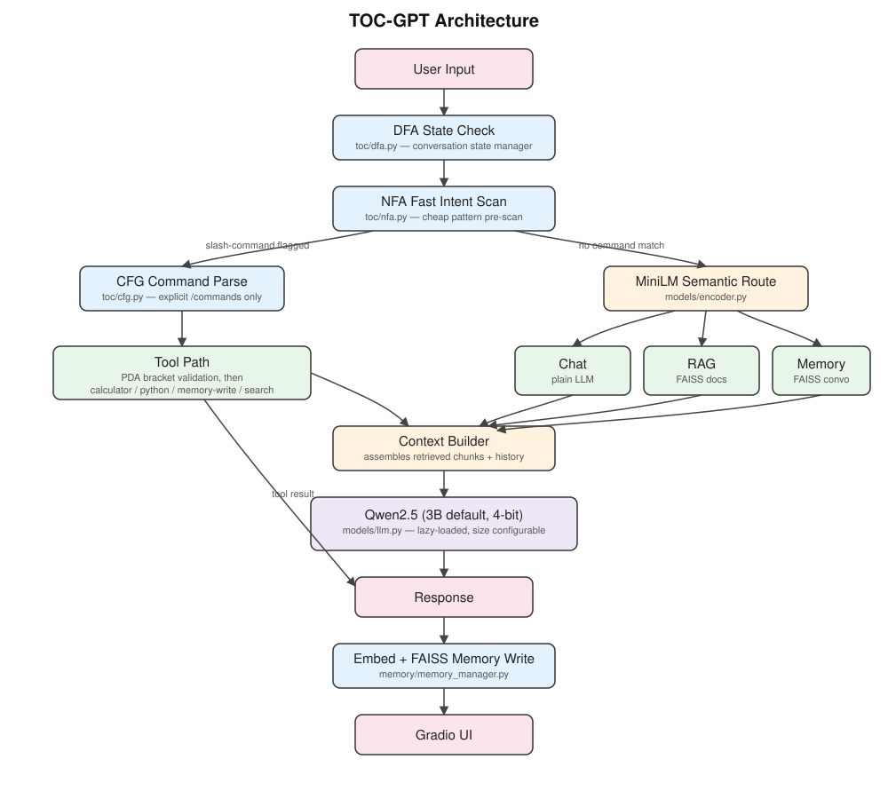

# TOC-GPT

A Theory-of-Computation-guided conversational AI using a quantized LLM,
semantic embeddings, RAG, memory, and tool calling.

> Educational replica inspired by ChatGPT's shape — not a reproduction of
> the actual ChatGPT model.

## Architecture



## What's real vs. what's framing

Every TOC module in this repo does a genuine, testable job — nothing here
is decoration bolted on for the acronym:

| Module | File | Concrete job |
|---|---|---|
| DFA | `toc/dfa.py` | Tracks the actual conversation state machine (`IDLE → ROUTING → TOOL_CALL → ...`). Illegal transitions raise an error instead of silently misbehaving. |
| NFA | `toc/nfa.py` | Cheap, parallel pattern pre-scan (slash-commands, bare math, doc questions, memory recall) run *before* paying for a MiniLM embedding. Never blocks — an empty match just falls through. |
| CFG | `toc/cfg.py` | Parses **only** explicit `/command` syntax. Free-form chat never reaches this parser, so it can't reject a valid natural-language query. |
| PDA | `toc/pda_bracket_validator.py` | Stack-based bracket/nesting validator, run before any expression reaches the calculator's AST evaluator. A DFA provably can't do this (unbounded nesting depth needs a stack). |
| Turing Machine | — (write-up only) | Kept as an academic/report-level framing, not runtime code — see project report, not source. |

The Turing Machine is intentionally *not* implemented as code: claiming a
"live TM" in a chatbot pipeline would be dishonest scaffolding. It belongs
in your report as the theoretical ceiling of the model, not as a file.

## Models

- **LLM**: `Qwen/Qwen2.5-3B-Instruct-GPTQ-Int4` by default (set `TOC_GPT_MODEL`
  env var to switch, e.g. to the 7B variant if you have more VRAM/time budget).
  3B is the default because a 7B model's cold-start load time can blow HF
  Spaces ZeroGPU's request timeout, and 3B leaves headroom for RAG + memory
  context on a T4.
- **Encoder**: `sentence-transformers/all-MiniLM-L6-v2`, CPU by default.
- **Vector store**: FAISS (CPU), shared implementation for both RAG chunks
  and conversation memory.

## Local setup

```bash
pip install -r requirements.txt
python app.py
```

## Testing the TOC layer without a GPU

Every TOC/tool module is import-safe without torch/transformers installed
(model loading is lazy, deferred to first `.generate()`/`.encode()` call),
so you can sanity-check the logic layer on a laptop before touching Colab:

```bash
python -m toc.dfa
python -m toc.nfa
python -m toc.cfg
python -m toc.pda_bracket_validator
python -m tools.calculator
python -m tools.python_tool
python -m rag.chunker
```

## Deployment plan

1. **Develop** on Colab/Kaggle T4 — build and test the full pipeline with
   the 3B model.
2. **Validate ZeroGPU cold-start FIRST** — before writing RAG/memory code,
   push a hello-world Gradio + ZeroGPU Space with just the LLM loaded and
   measure actual cold-start latency. This is the single biggest risk to
   the free-deployment goal. If it's too slow even at 3B, consider:
   - dropping to a 1.5B model, or
   - switching to a GGUF quant + llama.cpp on an always-on CPU Space
     instead of ZeroGPU.
3. **Push to GitHub**, then **deploy to Hugging Face Spaces** (Gradio SDK,
   ZeroGPU hardware).

## Project structure

```
TOC-GPT/
├── app.py                  # entrypoint (HF Spaces looks for this)
├── requirements.txt
├── docs/
│   └── architecture.svg     # architecture diagram
├── toc/
│   ├── dfa.py               # conversation state manager
│   ├── nfa.py                # fast intent pre-scanner
│   ├── cfg.py                 # explicit slash-command parser
│   ├── pda_bracket_validator.py  # bracket/nesting validator
│   └── state_manager.py      # per-session DFA instances
├── models/
│   ├── llm.py                # Qwen wrapper, lazy-loaded, size configurable
│   └── encoder.py            # MiniLM wrapper
├── memory/
│   ├── memory_manager.py     # conversation memory on FAISS
│   └── faiss_store.py        # shared FAISS wrapper
├── rag/
│   ├── loader.py              # PDF/TXT loading
│   ├── chunker.py             # ~500-800 token chunking
│   └── retriever.py           # ingest + retrieve
├── tools/
│   ├── calculator.py          # PDA-validated, AST-whitelisted calculator
│   ├── python_tool.py         # restricted python exec, best-effort only
│   └── router.py              # the actual pipeline glue
├── data/
│   ├── documents/             # ingested RAG sources + saved index
│   └── conversations/         # saved memory index
└── ui/
    └── gradio_app.py           # Gradio chat interface
```

## Known limitations (be upfront about these in your writeup)

- `tools/python_tool.py` restricts builtins but is **not** a real sandbox —
  fine for a personal/portfolio demo, not for untrusted public input without
  further isolation (subprocess/container).
- ZeroGPU free quota is limited; treat the public deployment as a
  demo/portfolio artifact, not a production service.
- The Turing Machine layer is a conceptual framing for the report, not
  runtime code — don't claim otherwise in a writeup or interview.
